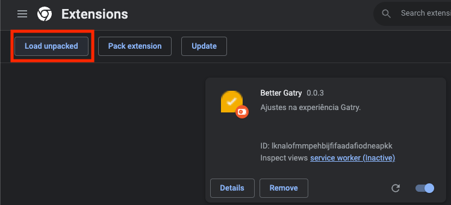

# Ajustes na experiência Gatry.

-   [Instalação por script](#instalação);
-   [Instalação local](#instalação-local);
-   Chrome web Store (Soon™️);

 

# Instalação

Utilize a URL abaixo em plugins de personalização. Como:

-   [Violentmonkey](https://violentmonkey.github.io) (indicação de [GigaChad](https://gatry.com/usuarios/detalhe/GigaChad));
-   Eu uso o [Custom Style Script](https://chrome.google.com/webstore/detail/custom-style-script/ecjfaoeopefafjpdgnfcjnhinpbldjij) (Windows) e [Userscripts ](https://apps.apple.com/us/app/userscripts/id1463298887) (Mac).

 

## CDN

`https://website-thumbnail-gataquadrada.vercel.app/public/main.min.js`

 

## Plugin para Chrome/Opera/Firefox?

_(Estamos trabalhando em uma versão para a Chrome store)_

## Instalação (local)

Por [williamarcondes](https://github.com/williamarcondes/).

1. Baixe a pasta [bttg-manifest-v2](/bttg-manifest-v2) em sua máquina;
2. Acesse a url `chrome://extensions/`;
3. Clique em `Load unpacked`;
4. Selecione a pasta `bttg-manifest-v2`, em seu computador;
5. Pronto!

 
 

# Funcionalidades

## Dark mode

Basta clicar no Sol/Lua no topo da tela, para alternar.

  
 

## Botão de bloquear usuário

A lista de bloqueio é salva no seu navegador. Então, limpeza de cache (e outras ações de anonimato) irão reiniciar as configurações.

Ainda não decidi se vou oferecer uma forma de salvar permanente.

  
 

## Lista de bloqueio

Visualize usuários bloqueados e desfaça bloqueios.

 
 

## Pré-visualizar links

_Depende de um serviço de terceiros..._.

 
 

## Backup

Faça backup das suas configurações e transfira entre computadores.

 
 

# A fazer

-   ⬜ Filtrar usuários bloqueados antes de carregar comentários.
-   ✅ Filtrar descontos duplicados, ao rolar a página.
-   ✅ Filtrar posts duplicados, ao rolar a página.
-   ✅ Salvar preferências de forma (mais) permanente.
-   ⬜ Adicionar destaque para termos importantes.
-   ✅ Adicionar selo de verificação.
-   ⬜ Perguntar ao Mr.G se posso adicionar "Deslikes" e lista de usuários que deram "Like".
-   ✅ Carregar imagens em comentários.
-   ✅ Pré-visualizar links em comentários.
-   ⬜ Botão de compartilhar no WhatsApp/Email/Twitter/Facebook em ofertas.
-   ⬜ Botão de compartilhar no WhatsApp/Email/Twitter/Facebook em posts livres.
-   ⬜ Seletor de GIFs em comentários.
-   ⬜ Upload de imagens para IMGUR em comentários.
-   ⬜ Gif avatars.
-   🔄️ Achar a minha [LTT Screwdriver](https://www.lttstore.com/products/screwdriver).
-   ✅ Criar um CDN/API via [Vercel](https://website-thumbnail-gataquadrada.vercel.app/public/main.min.js).

 

# Changelog

0.0.4

-   Link preview.

0.0.3

-   Code cleaning (more like refactoring galore).
-   Verified badges.
-   Bugfixes.
-   Badges will come from the latest branch.
-   Fixed a bug with duplicated posts check.

0.0.2

-   ???

0.0.1

-   Introduction.
